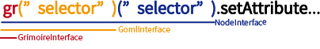

When using Grimoire.js for the first time, the first javascript API to handle is probably these top level APIs. These APIs make it easier for users to manipulate 3D canvas parts in a way that matches the logic of their services.



Top-level APIs are divided into four main parts as shown in the above figure, and their roles are different.

---

# GrimoireInterface

Mainly ** It does not depend on specific GOML source ** We provide API to operate on target.

** Example **

- registerNode method
- registerComponent method
- ... etc

GrimoireInterface will be assigned to `window.gr` if it is simply loaded into a web page using the` <script> `tag.

GrimoireInterface can also be obtained using npm as follows. In this case GrimoireInterface is available without rewriting window or less.

```javascript
Var gr = require ("grimoirejs");
```

## gr ("selector")

- ** Definition **

  ```typescript
  Function gr (selector: string): GOMLInterface;
  ```

- ** How to use **

  GrimoireInterface can pass a selector as a function. This selector is a notation for selecting GOML and specifies a selector for getting the node specified by `text =" text/goml "`.

  ```javascript
  Var theCanvas = gr ("script.mainCanvas");
  ```

  For example, in the above example, the interface that processes the GOML to which all script tags specified with the `mainCanvas` class are bound is acquired.

  > Attention:

  > Please be aware that the GOML of the operation target to be acquired is not limited to one. Please note that the target to retrieve is `script` instead of` canvas`.

## gr.ns (namespace)

- ** Definition **

  ```typescript
   Function ns (namespace: string): (name: string) => NamespacedIdentity;
  ```

- ** Usage: **

  The ns method is used to use the namespace for identifying the name of each node, component etc. used by Grimoire.js.

  When creating components or nodes that other people will use, you will need to use them to prevent conflicting names.

  ```javascript
  Var g = gr.ns ("http://grimoire.gl/ns/sample");
  Var id = g ("TEST");//Fully qualified name TEST | http://GRIMOIRE.GL/NS/SAMPLE is an object.
  ```

## registerComponent

- ** Definition **

  ```typescript
  Interface IAttributeDeclaration {
    Converter: string | NamespacedIdentity;
    DefaultValue: any;
  }

  Function registerComponent (
       Name: string | NamespacedIdentity,
       Attributes: {[name: string]: IAttributeDeclaration},
       Component: Object | (new () => Component)
  ): Void;
  ```

- ** How to use **

  Add a component with the specified name. If the argument `name` is specified as` NamespacedIdentity`, it is distinguished as a tag containing a namespace. On the other hand, when the argument `name` is` string`, we treat the namespace as ** default namespace **.

  The argument `attributes` is an attribute exposed by this component. This is a plane object with the value 'IAttributeDeclaration`. The key of this plane object is used as an attribute name. (The namespace is always the namespace of this component.) Users can assign values ​​to attributes specified in this attributes through GOML or manipulate values ​​through attr methods etc.

  The argument `component` is the` constructor function `or` plane object `of the component you wish to register newly. However, the plane object is converted inside the method into a constructor. Also, if you specify a constructor, the superclass of its constructor must contain a Component.

## registerNode

- ** Definition **

  ```typescript
  Function registerNode (
    Name: string | NamespacedIdentity,
    RequiredComponents: (string | NamespacedIdentity) [],
    DefaultValues ​​?: {[key: string]: any} | NamespacedDictionary <any>,
    SuperNode ?: string | NamespacedIdentity,
    RequiredComponentsForChildren ?: (string | NamespacedIdentity) []
  ): Void
  ```

- ** How to use **

  Add a node with the newly specified name. If the argument `name` is specified as` NamespacedIdentity`, it is distinguished as a tag containing a namespace. On the other hand, when the argument `name` is` string`, we treat the namespace as ** default namespace **.

  The argument `requiredComponents` has an array of components to hold when its named node is in its initial state. This array can have `string` or` NamespacedIdentity` as an element. When receiving this array, the `string` element will automatically treat the namespace as ** default namespace **.

  The argument `defaultValues` represents the initial value of each attribute of this node. If you pass just a plain object for this argument, ie `{[key: string]: any}`, interpret `key` as an attribute name and add ** node namespace ** as the attribute namespace I will use it. If you want to assign initial values ​​for attributes outside the namespace of the node, assign this argument using `NamespacedDictionary <any>`.

  > Default value assignment Priority:

  > The value assigned to an attribute when a node is loaded is assigned according to the following priority.

  > `Designation by GOML> Specification by defaultValues ​​in registerNode> Specification by attributes in registerComponent`

  > That is, for attributes not described in GOML at initial loading, defaultValues ​​in registerNode are searched and if not found, load initial values ​​from attributes in registerComponent.

  The argument `superNode` specifies the name of the node from which this node inherits its configuration. When this argument is specified, `requiredComponents`,` defaultValues`, `requiredComponentsForChildren` of the node associated with` superNode` are recursively inherited.

  The argument `requiredComponentsForChildren` receives a list of the names of the components to be requested for the node specified as a child node of this node. When this element is specified, all elements described in GOML, etc. as child nodes below this node must possess the specified component.

# GOMLInterface

It mainly ** depends on specific GOML source ** We provide API to manipulate target.

You can manipulate one or more GOML via GOMLInterface.
GOMLInterface can be obtained mainly by calling GrimoireInterface as a function.
At this time, the GOML that is the target of the selector becomes the operation target of this GOMLInterface.

** Example **

- (None)

## gr ("gomlSelector") ("nodeSelector")

- ** Definition **

  ```typescript
  Function (selector: string): NodeInterface;
  ```

- ** How to use **

  GomlInterface can pass a selector as a function. This selector is a notation for selecting a Node and specifies a selector for acquiring the NodeTree node of the GOML group that this GOMLInterface is targeting.

  ```javascript
  Var cubes = gr ("script.mainCanvas") ("cube");
  ```

  For example, in the example above, all the script tags specified by the `mainCanvas` class are associated with each other GOML can get the interface targeting all nodes specified by the` cube` class.

  > Attention:

  > Please be aware that the number of operation target nodes to be acquired is not limited to one.


---

# NodeInterface

Mainly provides ** API to operate on specific Node **.

It provides operations targeting one or more nodes.

** Example **

- append method
- getComponent method
- forEach method
- remove method
- ... etc

## gr ("gomlSelector") ("nodeSelector") ("componentSelector")
- ** Definition **

  ```typescript
  Function (selector: string): ComponentInterface;
  ```

- ** How to use **

  NodeInterface can pass a selector as a function. This selector is a notation for selecting a Component, and specifies a component from the target node group

  ```javascript
  Var components = gr ("script.mainCanvas") ("cube") ("a");
  ```
## isEmpty
Confirm that there is at least one target of this NodeInterface.
Returns true if it exists, false if none exists.
  ```typescript
  If (gr ("script.mainCanvas") ("cube"). IsEmpty ()) {
   //nodeInterface is empty!
  }
  ```
##
Specify the node from the target node group and retrieve it.
You can specify goml and node index.
If you omit the index of goml, it returns the node with the specified index over all goml.
If no argument is specified, the first node is returned.
In any case, throw an exception if the node does not exist at the specified position.
  ```typescript
  Var nodeInterface = gr ("script.mainCanvas") ("cube");
  Var gomlIndex = 2;
  Var nodeIndex = 1;
  If (nodeInterface. IsEmpty ()) {
    Var firstNode = nodeInterface.get ();//error: this NodeInterface is empty.
    Var secondNode = nodeInterface.get (nodeIndex);//error: index out of range.
  } Else {
    Var firstNode = nodeInterface.get ();
    Var secondNode = nodeInterface.get (nodeIndex);
    Var secondNodeIsThirdGOML = nodeInterface.get (gomlIndex, nodeIndex);
  }
  ```
## getAttribute
Specify the attribute name and acquire the ** attribute of the first node ** of the target node.
  ```typescript
  Var cube_position = gr ("script.mainCanvas") ("cube"). GetAttribute ("position");
  Console.log (cube_position.X);
  Console.log (cube_position.Y);
  Console.log (cube_position.Z);
  ```
## setAttribute
Specify attribute name, ** Set ** attributes of all target nodes
  ```typescript
  Gr ("script.mainCanvas") ("cube"). SetAttribute ("color", "red");
  ```
## addComponent
Add components to all target nodes.
  ```typescript
  Gr ("script.mainCanvas") ("cube"). AddComponent ("rotateAround");
  ```
## append
For each target node, add a node with the specified tag to the child element.
  ```typescript
  Append ("<mesh geometry =" quad "color =" brown "/>"); gr ("script.mainCanvas")
  ```
## children
Get a new nodeInterface targeting a child element of a specific node group.
## off
If an event listener specified for the target node is registered, delete it
## on
Add an event listener to the target node.
## remove
Delete all target nodes.
  ```typescript
  Gr ("script.mainCanvas") ("cube"). Remove ();
  ```
## forEach
Iterate over all nodes that this node interface is targeting.
You can refer to the node and its index of goml, index on goml.
  ```typescript
  Gr ("script.mainCanvas") ("cube"). ForEach ((node, gomlIndex, nodeIndex) => {
    Node.setAttribute ("position", `$ {gomlIndex}, $ {nodeIndex}, 0`);
  });
  ```
## setEnable
Enable or disable the target node for this node interface.
  ```typescript
  Gr ("script.mainCanvas") ("cube"). SetEnabled (false);
  ```
## first
Returns the first node of the target node group. When it does not exist, it returns null.
## single
If the target node group contains only one node, it returns it. Throws an exception when the number of nodes is 0 or 2 or more.
## count
Count the number of target nodes.
  ```typescript
  Var count = gr ("script.mainCanvas") ("cube"). Count ();
  ```
---

# ComponentInterface

Mainly ** Used for processing ** belonging to a specific Node.

- attr method
- destroy method
- ... etc

## getAttribute
Returns the Attribute of a specific component group. Or, set the value to a specific Attribute.
## setAttribute
## destroy
Deletes the specified component group.
## count
Count the number of target nodes.
  ```typescript
  Var count = gr ("script.mainCanvas") ("cube"). Count ();
  ```
##
Specify the component from the target component group and retrieve it. If it does not exist it is null, and if it is ambiguous it will throw an error

