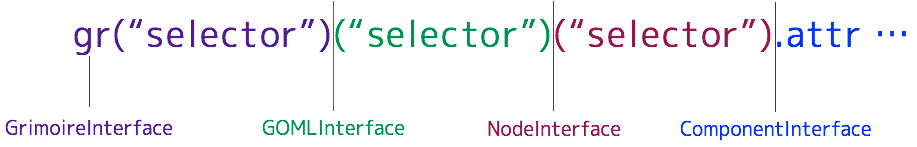

Grimoire.jsを初めて用いる際、最初に扱うjavascriptのAPIはおそらくこれらのトップレベルAPIでしょう。 これらのAPIによってユーザーは自身のサービスのロジックにマッチした形で3Dのキャンバス部分を操作することが容易になります。



トップレベルのAPIは以上の図のように主に4つに分割され、それぞれ役割が異なります。

---

# GrimoireInterface

主に**特定のGOMLソースに依存しない**対象に対して操作するAPIを提供します。

**例**

- registerNodeメソッド
- registerComponentメソッド
- ...etc

GrimoireInterfaceは`<script>`タグを用いて単にWebページにロードされている場合、`window.gr`に代入されます。

GrimoireInterfaceはnpmを用いて以下のようにしても取得することができます。この場合window以下を書き換えることなくGrimoireInterfaceが利用可能です。

```javascript
var gr = require("grimoirejs");
```

## gr("selector")

- **定義**

  ```typescript
  function gr(selector: string): GOMLInterface;
  ```

- **使い方**

  GrimoireInterfaceは関数としてセレクタを渡すことができます。 このセレクタはGOMLを選択するための記法であり、`text="text/goml"`の指定されているノードを取得するためのセレクタを指定します。

  ```javascript
  var theCanvas = gr("script.mainCanvas");
  ```

  例えば、上記の例では`mainCanvas`クラスが指定されたscriptタグ全てが結びついているGOMLに対して処理をするインターフェースが取得されます。

  > 注意:

  > 取得される操作対象のGOMLが一つとは限らない事に気をつけてください。取得する対象が`canvas`ではなく`script`である事に注意してください。

## gr.ns(namespace)

- **定義**

  ```typescript
   function ns(namespace: string): (name: string) => NamespacedIdentity;
  ```

- **使い方:**

  nsメソッドはGrimoire.jsが用いる各ノードやコンポーネントなどの名前の識別のために名前空間を用いるために使います。

  自分以外の人が用いるであろうコンポーネントやノードを作成する場合、名称が被って競合するのを防ぐために利用する必要があるでしょう。

  ```javascript
  var g = gr.ns("http://grimoire.gl/ns/sample");
  var id = g("TEST"); //完全修飾名 TEST | HTTP://GRIMOIRE.GL/NS/SAMPLEを意味するオブジェクトとなる。
  ```

## registerComponent

- **定義**

  ```typescript
  interface IAttributeDeclaration {
    converter: string | NamespacedIdentity;
    defaultValue: any;
  }

  function registerComponent(
       name: string | NamespacedIdentity,
       attributes: { [name: string]: IAttributeDeclaration },
       component: Object | (new () => Component)
  ): void;
  ```

- **使い方**

  指定した名称のコンポーネントを追加します。 引数`name`が`NamespacedIdentity`として指定されると、名前空間を含んだタグとして区別されます。 一方で引数`name`が`string`である際は名前空間を**デフォルト名前空間**として処理します。

  引数`attributes`はこのコンポーネントが公開する属性です。これは値として`IAttributeDeclaration`を持つプレーンオブジェクトです。このプレーンオブジェクトのkeyが属性名として用いられます。(常に名前空間はこのコンポーネントの名前空間です。) ユーザーはこのattributesに指定されている属性に対してGOMLを通じて代入したりattrメソッドなどを通じて値を操作できたりします。

  引数`component`は新しく登録したいコンポーネントの`コンストラクタとなる関数`もしくは`プレーンオブジェクト`です。 ただし、プレーンオブジェクトはメソッド内部でコンストラクタに変換します。また、コンストラクタを指定する場合はそのコンストラクタのスーパークラスにComponentが入っていなければなりません。

## registerNode

- **定義**

  ```typescript
  function registerNode(
    name: string | NamespacedIdentity,
    requiredComponents: (string | NamespacedIdentity)[],
    defaultValues?: { [key: string]: any } | NamespacedDictionary<any>,
    superNode?: string | NamespacedIdentity,
    requiredComponentsForChildren?: (string | NamespacedIdentity)[]
  ): void
  ```

- **使い方**

  新たに指定した名称のノードを追加します。引数`name`が`NamespacedIdentity`として指定されると、名前空間を含んだタグとして区別されます。一方で引数`name`が`string`である際は名前空間を**デフォルト名前空間**として処理します。

  引数`requiredComponents`はその名称のノードが初期状態のときに保持するコンポーネントの配列を持ちます。この配列は要素として`string`もしくは`NamespacedIdentity`を持つことができます。 この配列を受け取った際、`string`な要素は自動的に名前空間を**デフォルト名前空間**として処理します。

  引数`defaultValues`はこのノードの各属性の初期値を表します。この引数に対して単なるプレーンオブジェクトすなわち`{[key: string]: any}`を渡した場合は、`key`を属性名として解釈し、属性の名前空間として**ノードの名前空間**を用います。もし、ノードの名前空間外の属性に対して初期値を割り当てたい場合は`NamespacedDictionary<any>`を用いてこの引数を割り当てます。

  > デフォルト値の割り当て優先順位:

  > あるノードが読み込まれた時に属性に割り当てられる値は以下の優先順位に従って割り当てられます。

  > `GOMLによる指定 > registerNode内のdefaultValuesによる指定 > registerComponent内のattributesによる指定`

  > すなわち、初期ロード時にGOMLに記述されていない属性についてはregisterNode内のdefaultValuesが検索され、それも見つからない場合はregisterComponent内のattributesから初期値をロードします。

  引数`superNode`はこのノードが設定を継承する元のノード名を指定します。この引数が指定されると、`superNode`に対応付いたノードの`requiredComponents`,`defaultValues`,`requiredComponentsForChildren`が再帰的に引き継がれます。

  引数`requiredComponentsForChildren`はこのノードの子ノードに指定されるノードに要求するコンポーネントの名称のリストを受け取ります。 この要素が指定されると、このノード以下の子ノードとしてGOML内などに記述されるすべての要素は指定されたコンポーネントを所持している必要があります。

# GOMLInterface

主に**特定のNodeに依存せず、特定のGOMLのソースに依存する**対象に対して操作するAPIを提供します。

**例**

- sharedObjectフィールド
- rootNodeフィールド
- ...etc

## 関数として呼んだ場合

---

# NodeInterface

主に**特定のNode**に対して操作するAPIを提供します。

**例**

- appendメソッド
- getComponentメソッド
- ...etc

## 関数として呼んだ場合
## addComponent
特定のノード群にコンポーネントを追加します。
## append
特定のノード群に対して、指定したタグを持つノードを子要素に追加します。
## attr
特定のノード群のAttributeを返します。または、特定のAttributeに値をセットします。
## children
特定のノード群の子要素を取得します。
## compareClass
このノードは特定のclassに属しているかを真偽値で判定します。
## find
特定のノードに対して、指定したノードを取得します。
## off
対象ノードに指定したイベントリスナが登録されていれば削除します
## on
対象ノードにイベントリスナを追加します。
## remove
特定のノード群に対して、指定した子要素のノードを取り除きます。

---

# ComponentInterface

主に**特定のNodeに属しているコンポーネント**に対する処理に利用します。

- attrメソッド
- destroyメソッド
- ...etc

## attr
特定のコンポーネント群のAttributeを返します。または、特定のAttributeに値をセットします。
## destroy
指定したコンポーネント群を消去します。
## get
指定した
