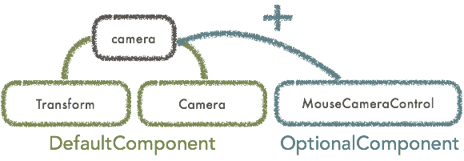
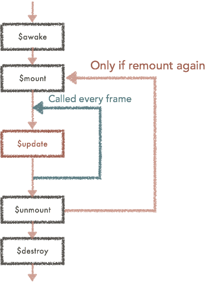

# What's Grimoire.js?

**Grimoire.js** is **WebGL framework for Web development** in short.

Currently, WebGL designing require highly developed graphics knowledge and is very difficult to co-work in previous Web development flow.
Grimoire.js is the framework that enables these design in **Previous web development flow**, **Minimal codes**, **Very easy and effective** and **Production level**.

Previous libraries to use WebGL is mostly focusing on game development not Web applications.
Most of them are just ported API's grown in game development field and Web designers need to adopt them to follow that culture. And that culture is vastly differ from common web development culture.

`WebGL` has infinity visualization possibility. However, it can't be used as easy as images or videos.

But, you can, if your development using Grimoire.js.

# What Grimoire.js can do?

Several samples are available using Grimoire.js.

* [SUSHI](https://pnlybubbles.github.io/custom-sushi-3d/)
* [Many samples created by third party](http://jsdo.it/tag/Grimoire.js)

# Getting started

You need to make simple HTML to use Grimoire.js. Then, you can link Grimoire.js with the following tag.

```html
<script src="https://unpkg.com/grimoirejs-preset-basic/register/grimoire-preset-basic.js"></script>
```

> This script is not `pure` Grimoire.js. This file includes several plugins you might need to use.

If you need minified scirpt file or you want to use npm, please check [Installation](https://grimoire.gl/guide/installation.html) page.

# Markup for Grimoire.js

`Grimoire.js` use simple markup file to configure initial state of the canvas. This markup language is called as `GOML`.
Let's write the code below in your html.

```xml
<body>
  <script type="text/goml">
    <goml>
     <scene>
      <camera/>
      <mesh color="red" position="0,0,0"/>
     </scene>
    </goml>
  </script>
</body>
```

[SAMPLE](https://grimoiregl.github.io/grimoire.gl-example/#guide-01)

Grimoire.js try to read `<script>` element specified `type='text/goml'` and insert `<canvas>` element at the same position.

Let's modify position attribute on `<mesh>`. You might realized you could moved the mesh.
All Grimoire.js objects can be operated just like HTML elements.

> Loading GOML files
>  
> In the same way as loading javascript with `<script>` element, you can specify `src='URL of GOML file'` to load GOML file from out side.
> In this tutorial, we use embedded GOML file, but we strongly recommend not to do so but link them.

You can use multiple canvases with 2 goml codes in same way.

[SAMPLE](https://grimoiregl.github.io/grimoire.gl-example/#guide-02)

# Mutation with Javascript API

```xml
<script type="text/goml" id="canvas1">
  <goml>
   <scene>
    <camera/>
    <mesh color="red" position="0,0,0"/>
   </scene>
  </goml>
</script>
<script type="text/goml">
  <goml>
   <scene>
    <camera/>
    <mesh color="green" position="0,0,0"/>
   </scene>
  </goml>
</script>
```
Let's prepare GOML code like above and execute a javascript below.

```javascript
gr(function(){
  setTimeout(function(){
    gr("#canvas1")("mesh").setAttribute("color","blue");
  },1000);
});
```

Then, you can see that the color of a mesh in the one of the canvas are changed after 1 secound.

[SAMPLE](https://grimoiregl.github.io/grimoire.gl-example/#guide-03)

If you have used `jQuery` ever, you would notice that this API is very similar to jQuery API.

> Waiting for initialized timing
>
> When you pass a function to `gr` as an argument, the function would be called after initializing grimoire.

> Querying objects
>
> When you pass a string which is query string for the **`<script>` element** to `gr` as an argument, the returned object is the interface to manipulate nodes in releated canvas.
> And you can query in the goml same way. In the example above, the queried objects are whole mesh included in the script quried with `#canvas1`.

# Node, Component system

Acutually, the most important aspect of grimoire is not the feature we can write in almost same way as Web development.
Even we develop good abstraction for WebGL to use in same way as web development, WebGL has tons of possibility to visualize. It is impossible that we prepare all tags for every web engineers.

However, component system of grimoire gives us good solution.

Let's see the GOML code below. Grimoire.js treat tags as nodes constructing tree structure.
But, the syntax `<camera.components>` is not ordinary tag but the syntax to append a component to `<camera>` tag.
The appended component `<MouseCameraControl>` is the component to operate positions and rotation with mouse operation.

```xml
<script type="text/goml" id="canvas1">
  <goml>
   <scene>
    <camera>
      <camera.components>
        <MouseCameraControl/>
      </camera.components>
    </camera>
    <mesh color="red" position="0,0,0"/>
   </scene>
  </goml>
</script>
```

[SAMPLE](https://grimoiregl.github.io/grimoire.gl-example/#guide-04)

In grimoire, nodes are including several modules called as **component**. In other words, nodes are just a container containing some components.


For example, `<mesh>` tag contains `Transform` component managing positions or rotations and `MeshRenderer` component managing rendering meshes by default.
As another example, `<camera>` tag contains `Transform` component and `Camera` component managing camera feature to  project scene.



Node names means what is default components are bound and what is the default values for the attributes.
By adding some components to node, you can append a `behaviour` to the object.


## Creating component

You can create component also.
Let's create `Rotate` component to rotate a mesh.

```js
gr.registerComponent("Rotate",{
  attributes:{
    speed:
    {
      default:1,
      converter:"Number"
    }
  },
  $mount:function(){
    this.phi = 0;
  },
  $update:function(){
    this.phi += this.getValue("speed");
    this.node.setAttribute("rotation",this.phi + "," + this.phi + "," + this.phi);
  }
})
```

You can register component with `gr.registerComponent`. We don't touch with component system in deeply here, but you can declare parameters which this component can receive.
These parameters are called `attribute`. In this example, the attribute `speed` is number type and default value is 1.

After loading the javascript, you need to inject GOML file to use that.

> Load javascript file to declare components
>
> You can simply link script tag with the code below.
> Make sure you need to load script tag after grimoire.js loaded.
```html
<script src="https://unpkg.com/grimoirejs-preset-basic/register/grimoire-preset-basic.js"></script>
<script src="./index.js"></script>
```

```xml
<script type="text/goml" id="canvas1">
  <goml>
   <scene>
    <camera>
      <camera.components>
        <MouseCameraControl/>
      </camera.components>
    </camera>
    <mesh color="red" position="0,0,0">
      <mesh.components>
        <Rotate/>
      </mesh.components>
    </mesh>
   </scene>
  </goml>
</script>
```

[SAMPLE](https://grimoiregl.github.io/grimoire.gl-example/#guide-05)

This figure describes lifecycle of a component. You don't need to understand now correctly, but this figure would be helpful in future.




The functions begins with `$` are called `message handler`, and these are called in specific timings in component lifecycle.

## Define node

If you need a lot of rotated mesh, the examples are inconvenient.
You can declare new node `rotated-mesh` which is originally `mesh` tag and just attached with `Rotate` component.
```javascript
gr.registerNode("rotated-mesh",["Rotate"],{},"mesh");
```

```xml
<script type="text/goml" id="canvas1">
  <goml>
   <scene>
    <camera>
      <camera.components>
        <MouseCameraControl/>
      </camera.components>
    </camera>
    <rotated-mesh color="red" position="-2,0,0"/>
    <rotated-mesh color="green" position="0,0,0" speed="2"/>
    <rotated-mesh color="blue" position="2,0,0" speed="3"/>
   </scene>
  </goml>
</script>
```

[SAMPLE](https://grimoiregl.github.io/grimoire.gl-example/#guide-06)

# Whats next?

These examples are only describes core features of grimoire in short. All components or nodes implemented in default are made with same way. There are no exception.

You might have understood basic concept of Grimoire.
Let's begin to learn Grimoire more with [tutorial](/tutorial.html).
