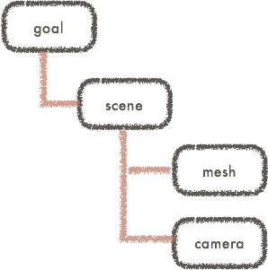
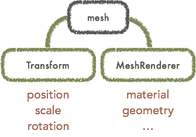

## Grimoire.jsとは?

**Grimoire(グリモア).js** は、一言で言えば、**Web開発のためのWebGLフレームワーク** です。 高度な知識が要求され、既存のWebの開発フローに乗りにくい`WebGL`表現を、**既存のWeb開発のフローで** 、 **最小限のコードで** 、**簡単に** 、**プロダクションレベルで** 扱うためのフレームワークです。

`WebGL`を扱うための技術は、つい最近までアプリケーションやゲーム開発のために進化したものでした。多くのライブラリは、それらに触れてきた開発者が、Web上で同様の機能を実装し、ユーザーもでこれに倣ってWebGLを扱うのが普通でした。

`WebGL`もWebの一つの選択肢であり、他の画像や動画と同じようなレベルで簡単に扱えなければなりません。Webフロントエンドは日々フレームワークの進化によりその難しさは日々増しています。このような中でどうして`WebGL`のためだけに全く違う書き方をするということを押し付けることができるでしょうか?

`Grimoire.js`は、このWebにおける`WebGL`のあり方を変えます。Webの人がWebの書き方流で扱え、もともとCGなどをいじっていた方は従来に似た書き方をすると、その部品はすぐにWeb畑の人が使えるようになる。**WebGLが画像や動画に次ぐWebエンジニアが持つ筆の一つにする。** それがGrimoire.jsの成し遂げることです。

## はじめに

`Grimoire.js`を試すには、まず単純な`.html`を作成して以下の`<script>`でロードします。

```html
<script src="https://unpkg.com/grimoirejs-preset-basic/register/grimoire-preset-basic.js"></script>
```

このスクリプトは単なる`Grimoire.js`ではなく、いくつかのプラグインが入っているものです。このスクリプトで最初に必要な最低限の機能が利用できます。

もし`minify`されたjsや、`npm`からの利用をしたいなら[ダウンロード](/guide/download.html)を参考にしてください。 **ただし、初心者にはまず`<script>`を用いての利用を推奨します。何事もシンプルなことから入るのが一番です**

## 宣言的なWebGLマークアップ

`Grimoire.js`では、WebGLを記述するためのマークアップ(GOML)を記述します。例えば、埋め込みたい位置に以下のように記述します。

```xml
<script type="text/goml">
  <goml>
   <scene>
    <camera/>
    <mesh color="red" position="0,0,0"/>
   </scene>
  </goml>
</script>
```

<iframe class="editor" src="https://grimoiregl.github.io/grimoire.gl-example/#guide-01">
</iframe>

このように、**`type='text/goml'`が指定されている`<script>`のある部分に`<canvas>`が挿入されて表示されます**

`<mesh>`の`position`属性を操作すれば、表示されている赤い四角形が動くのがわかります。一般的なHTMLの文章をいじるように このように宣言的に操作できるのです。

> GOMLファイルの読み込み

> javascriptファイルを読み込む際の`<script>`のように、`src="外部ファイルのURL"`を指定しても外部からgomlファイルを読み込むことができます。 このチュートリアルでは、簡略な説明のためhtmlに埋め込んでいますが、**通常は外部読み込みにすることを推奨します。**

当然、以下のように記述すれば複数個のキャンバスを扱うこともできます。

```xml
<script type="text/goml">
  <goml>
   <scene>
    <camera/>
    <mesh color="red" position="0,0,0"/>
   </scene>
  </goml>
</script>
<script type="text/goml">
  <goml>
   <scene>
    <camera/>
    <mesh color="green" position="0,0,0"/>
   </scene>
  </goml>
</script>
```

<iframe class="editor" src="https://grimoiregl.github.io/grimoire.gl-example/#guide-02">
</iframe>

## Javascriptによる操作

```xml
<script type="text/goml" id="canvas1">
  <goml>
   <scene>
    <camera/>
    <mesh color="red" position="0,0,0"/>
   </scene>
  </goml>
</script>
<script type="text/goml">
  <goml>
   <scene>
    <camera/>
    <mesh color="green" position="0,0,0"/>
   </scene>
  </goml>
</script>
```

に対して、以下のようなJSを実行すると、`Grimoire.js`が読み込まれてから1秒後に上の立方体だけ青くなります。

```javascript
gr(function(){
  setTimeout(function(){
    gr("#canvas1")("mesh").setAttribute("color","blue");
  },1000);
});
```

<iframe class="editor" src="https://grimoiregl.github.io/grimoire.gl-example/#guide-03">
</iframe>

`jQuery`を扱ったことがある人がいれば、似たようなAPIであると気がつくことでしょう。 `gr`は、`Grimoire.js`が定義するオブジェクトで、すべてのAPIはこれを通じてアクセスすることができます。

**`gr`に`function`を渡した時には、`Grimoire.js`の初期化が終わったタイミングで呼ばれます**

また、**`gr`に文字列を渡してクエリで`<script>`を指定し、それにたいして操作したいノードを取得するためのクエリを指定します** (grの最初の括弧で帰ってくるのは、ある`<script>`へのクエリということに注意してください。これは初めて使う方が陥りやすい最も多いミスの一つです。)

## Grimoire.jsのノード・コンポーネントシステム

これまでの議論は、他のタグベースのWebGLライブラリのものと変わりありません。 しかし、`Grimoire`におけるノードやコンポーネントのシステムを一度理解すれば、いかにこのノードのシステムがよくできているかわかることでしょう。

一般的にXMLやHTMLのDOMのシステムは、各ノードの親子関係を示すことができます。これはGOMLに於いても同じです。



実は、あるノードは **コンポーネント** と呼ばれる **一つの機能の集まり** によって構成されています。


例えば、`<mesh>`は常に、`Transform`という、座標や回転量などを管理するコンポーネントと`MeshRenderer`という、表示部分を管理しているコンポーネントの組みを意味します。

`<camera>`は`Transform`と、カメラの変換の仕組みなどを管理している`Camera`コンポーネントの組を意味します。

これらのコンポーネントは入力として**属性**を受け取ります。例えば、座標や回転量を管理する`Transform`は当然、`position`や`rotation`などの属性を持っています。



`<mesh>`に渡した、`position`属性は、この`<mesh>`が持っている`Transform`コンポーネントに渡され、パラメーターとして使用されます。このような属性は全て同様にjavascriptで操作ができます。

ここで、コンポーネントの力を把握するために、以下のように記述してカメラを動かせるようにしてみましょう。

```xml
<script type="text/goml" id="canvas1">
  <goml>
   <scene>
    <camera>
      <camera.components>
        <MouseCameraControl/>
      </camera.components>
    </camera>
    <mesh color="red" position="0,0,0"/>
   </scene>
  </goml>
</script>
```

<iframe class="editor" src="https://grimoiregl.github.io/grimoire.gl-example/#guide-04">
</iframe>

以上のように、`<camera>`の子要素である`<camera.components>`の中に`<MouseCameraControl>`を入れたことにより、普段`<camera>`が持つ`Transform`と`Camera`の他に、`MouseCameraControl`をつけたことになります。


### コンポーネントを書いてみる

まだ、コンポーネントが何か議論していませんでしたね。ここでは例えばくっつけた対象を回転させ続けるコンポーネント、`Rotate`を作ってみることにしましょう。

```javascript
gr.registerComponent("Rotate",{
  attributes:{
    speed:
    {
      defaultValue:1,
      converter:"Number"
    }
  },
  $mount:function(){
    this.phi = 0;
  },
  $update:function(){
    this.phi += this.getValue("speed");
    this.node.setAttribute("rotation",this.phi + "," + this.phi + "," + this.phi);
  }
})
```
`attributes`内の要素はこのコンポーネントが受け取れるパラメーター名とその詳細になります。
ここでは、深く触れないことにしますが、パラメータ名から分かる通り、数値であって、初期値が`1`であることを指し示しています。

これを書いた上で、いかのようなgomlを書いてみましょう。

```xml
<script type="text/goml" id="canvas1">
  <goml>
   <scene>
    <camera>
      <camera.components>
        <MouseCameraControl/>
      </camera.components>
    </camera>
    <mesh color="red" position="0,0,0">
      <mesh.components>
        <Rotate/>
      </mesh.components>
    </mesh>
   </scene>
  </goml>
</script>
```

<iframe class="editor" src="https://grimoiregl.github.io/grimoire.gl-example/#guide-05">
</iframe>

以下の図は、あるコンポーネントのライフサイクルを表します。今全てを理解する必要はありませんが、この図は将来あなたの役に立つことでしょう。


$から始まる関数は **メッセージハンドラー** と呼ばれ、コンポーネントのライフサイクルの随所で呼ばれることになります。
このメッセージハンドラー内の`this`はそれぞれのインスタンスにバインドされます。

メッセージハンドラーに関してはまだまだ触れなくてはならないことも多いのですが、ここでは単なるイベントハンドラーという程度の理解で問題ありません。

### ノードを定義してみる

もし、回転する`<mesh>`を大量に描きたいなら上のように書くのは不便ですね。ここで、`<rotated-mesh/>`なるものを用意するようにしてみましょう。

```javascript
gr.registerNode("rotated-mesh",["Rotate"],{},"mesh");
```

```xml
<script type="text/goml" id="canvas1">
  <goml>
   <scene>
    <camera>
      <camera.components>
        <MouseCameraControl/>
      </camera.components>
    </camera>
    <rotated-mesh color="red" position="-2,0,0"/>
    <rotated-mesh color="green" position="0,0,0" speed="2"/>
    <rotated-mesh color="blue" position="2,0,0" speed="3"/>
   </scene>
  </goml>
</script>
```

<iframe class="editor" src="https://grimoiregl.github.io/grimoire.gl-example/#guide-06">
</iframe>

## 次は

ここまで理解したあなたは`Grimoire.js`の最も基本的な仕組みを理解しています。全てはこの上に成り立っているのです。例外はありません。

このような構造を把握した上で、あなたが恐らく聞きたくて聴きたくてたまらないのは描画周りでしょう。どうしたら、モデルが書けるのか、テクスチャが貼れるのか。
そんなあなたは[チュートリアル](/tutorial)をする準備ができています。さあ、次の一歩へ進みましょう。
