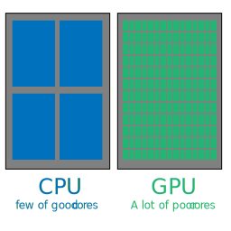
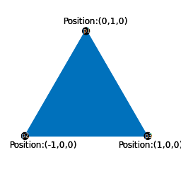
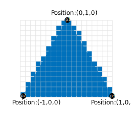

# Learn WebGL basics

This document is not only for Grimoire.js. All javascript library using WebGL take care of everything written in this section.
Even Grimoire.js provides easy interfaces for users, it is good to know what WebGL actually do and how Grimoire.js use them.

This document is short summary of concept of WebGL for users to understand our library easily.

## What is actually WebGL do?

Most of engineers who don't know WebGL would answer me `That is interface for using 3D on browser`.
But, that is incorrect. Most important part of WebGL is `That is interface for using GPU on browser`.

Of course, GPU is mostly used for graphics stuff including 3D. But, the possibility is not so limited.

## Graphics stuff

Today, we have good user friendly GUI applications including browsers. All of them are using display.
If that was in game, contents shown on display would be refreshed 60 times or more per second.

That mean 1920*1080(HD) display should calculate `1920*1080*60 = 124,416,000` pixels per second.
And resolutions are growing day by day. Some people have 4K display requiring more computation power.

## GPU vs CPU

So, determining each pixel on entire pixels are pretty heavy work for computers. In algorithm contest field, it is sometimes said that `O(10^8)` is the maximum of the algorithm to calculate per one second.

Therefore human made GPU for calculate each pixel independently.
Most of CPU may have only have 4 cores or 8 cores. But GPU can have 1000 cores or more.
When it come to say about power of single core, core of CPU have better clock than core of GPU.

Parallel computation is not always good solution. It is not working for the task that cannot be calculated independently.
But, in graphics field, there are a lot of tasks can be computed independently in same time.

For example, calculating position of vertices can be done independently. Each vertices should be independent from the other vertices basically.
Calculating color of pixels is also able to be calculated independently.

By using power of GPU for specific calculation, renderer can have great performance. That why we should know summary of GPU not to use renderer wrong way and make decreasing of performances.

## Rendering pipelines

Making sure rendering tasks being able to calculated independently, WebGL has specification that make sure how a polygons are calculated, what kind of arguments should be passed to GPU.
We need to know how to calculated a polygon to be displayed.

First of all, our renderer pass some information about vertices to GPU. In the figure above, each vertices have positions as argument.

Then, GPU would calculate vertices positions by a program working on GPU(Sometimes called as `shader`. And the shader works on this stage is especially called `vertex shader`)

In this time, some transform would be applied to vertices. If the model have skinning property to move joints, each joint positions and rotations must be considered in this time.

After that, GPU execute the task named `rasterize` which means split each polygons by pixels.

Then we need to calculate each color of pixels. And this task is also using a shader called `fragment shader` to determine colors for each.

Then the polygon would appear on display by writing the result of rendering into screen buffer.

## Rendering arguments

## Rendering states
