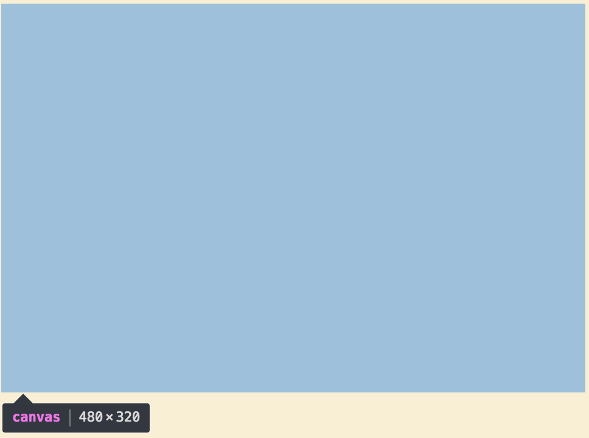

# Grimoire.jsの概要

Grimoire.jsはWeb3Dを扱うJavaScriptライブラリです。ユーザーはXMLに準拠した記法であるGOML(Grimoire-Object-Markup-Language)を用いて、簡易にWeb上に3Dの演出を加えることができます。 また、宣言的に記述した3Dの表現はJavaScript側から、属性を指定することにより操作することができます。


コンポーネントを作成することにより、GOMLは拡張可能です。基本的なコンポーネントは基本プラグインであるgrimoirejs-fundamentalに含まれています。grimoirejs-fundamentalを利用することによりユーザは3D空間の記述に必要になるであろうcameraやsceneタグを扱うことができるようになります。

## Grimoire.jsの基本

まずはじめに、Grimoire.jsの基本的な使い方を学びましょう。 このライブラリは、

- ユーザーが必要とするコンポーネントを含んだGrimoire.js本体(JavaScript)
- GOML
- GOMLを操作するためのJavaScript（動的な表現をここで記述する）

が必要になります。

そのため、最も簡単なサンプルコードは以下のようになります(grimoirejs-fundamentalプラグインを利用)。

```html
<!DOCTYPE html>
<html>

<head>
  <title></title>
  <script type="text/javascript" src="/product/grimoire.es2016.js"></script>
</head>

<body>
  <script id="main" type="text/goml" src="./index.goml"></script>
  <script type="text/javascript" src="./main.js"></script>
</body>

</html>
```

> 読み込むgomlに属性を指定することにより、JavaScript側からgomlのルート要素を取得することができるようになります。

基本的なgomlは以下の通りです。

```html
<goml width="480" height="320">
    <import-material type="color" src="./color.sort" />
    <geometry name="cube" type="cube" />
    <renderer camera=".camera" viewport="0,0,100%,100%">
        <render-scene/>
    </renderer>
    <scene>
        <camera class="camera"
        near="0.01" far="40.0" aspect="1.5" fovy="45d" position="0,0,10" rotation="y(0d)" />
        <mesh class="cube" position="0,0,0" geometry="cube" material="new(color)"/>
    </scene>
</goml>
```

各コンポーネントのattributeにはデフォルトで値が指定されていますが、gomlに記述することにより、その値を初期値として持つことができます。goml内で記述したノードには`id`や`class`を指定することにより、JavaScript側から簡単に取得することができるようになります。

```
(例) <mesh class="cube" position="0,0,0" geometry="cube" material="new(color)"/>
```

> grimoirejs-fundamentalの各コンポーネントのattributeに関して詳しくは[APIリファレンス](https://grimoire.gl/api/grimoirejs-fundamental.html)を参照してください。

JavaScript側では以下のような記法でgomlのノードを取得することができるようになっています。

```javascript
gr(#main)(.cube).attr("position","0,3,0");
```

以上の記述で、`id="main"`を指定したgoml内の`class="cube"`属性を持つものを取得しています。attrメソッドでは指定したattributeに対して値を動的に指定することができます。

### 1. canvasを表示する

Grimoire.jsでは3D表現を扱う際にHTML5の仕様である`<canvas>`タグを使用しています。`canvas`はGrimoire.jsとgomlを読み込むことにより、自動的に生成されます。まずはこのcanvasを表示してみましょう。

```html
<goml>
</goml>
```

以下のgomlを読み込むことによりデフォルト値に対応したcanvas(680*480)がブラウザの左上に表示されます。

```html
<goml width="480" height="320">
</goml>
```

またブラウザの画面サイズに合わせて表示したい場合は`width`や`height`に`"fit"`という値を与えることにより、canvasの大きさを自動で合わせることができます。




また、Grimoire.jsではcanvasを生成する際に、`<div>`タグでcanvasを取り囲みますが、gomlにcontainerIdを付与することにより、`canvas`を囲んでいる`div`要素に`id`を付与することができます。

```html
<goml width="480" height="320" containerId="main-canvas">
</goml>
```

> 標準(grimoirejs-fundamental)のカメラコンポーネントはリサイズ時のcanvasのアスペクト比を自動で変更する仕様になっていますが、リサイズの際にはアスペクト比の調整に留意することが推奨されます。

canvasのフルスクリーン表示にも対応しており、fullscreen属性を`true`にすることで扱えます。

```html
<goml width="480" height="320" enableLoader="true">
</goml>
```

canvas生成の際に、loadingのアニメーションが表示されますが、enableLoader属性を`true`にすることでその表示を消すことができます。

### 2.カメラをシーンに配置し、図形を配置する

基本的なgomlの一つを以下に示します。 gomlはcanvas上で3D表現を行うためにcameraとscene、rendererを必要とします。cameraはsceneの子要素に配置することが必要です。

```html
<goml>
    <import-material type="color" src="./color.sort" />
    <geometry name="cube" type="cube" />
    <renderer camera=".camera" viewport="0,0,100%,100%">
        <render-scene/>
    </renderer>
    <scene>
        <camera class="camera"
        near="0.01" far="40.0" aspect="1.5" fovy="45d" position="0,0,10" rotation="y(0d)" />
        <mesh position="0,0,0" geometry="cube" material="new(color)"/>
    </scene>
</goml>
```

Grimoire.jsではGrimoire.js用の拡張シェーダー記法(Sort(ソール))を用いてシェーダーを記述することができます。 後で、`.sort`に関しても記載しますが、今はひとまず省略します。

```
//color.sort
@Pass
attribute vec3 position;
@vert{
  uniform mat4 _matPVM;
  void main(){
    gl_Position = _matPVM * vec4(position,1);
  }
}
@frag{
  @{type:"color", default:"#381794"}
  uniform vec4 color;
  uniform float _time;
  void main(){
    gl_FragColor = color;
  }
}
```

> grimoirejs-fundamentalがサポートしている`Sort`の仕様に関して詳しくは[Grimoire.jsのシェーダー](https://grimoire.gl/guide/sort.html)を参照してください。

以下のgomlを読み込むことで下図のようなcubeがcanvas上に表示されるはずです。


rendererは省略可能で、以下のようにgomlにはsceneとcameraを記述することでも動作します。

> 省略する際にはrendererが`class="camera"`を参照している点に注意が必要です。

```html
<goml width="480" height="320">
    <import-material type="color" src="./color.sort" />
    <geometry name="cube" type="cube" />
    <scene>
        <camera class="camera"
        near="0.01" far="40.0" aspect="1.5" fovy="45d" position="0,0,10" rotation="y(0d)" />
        <mesh position="0,0,0" geometry="cube" material="new(color)"/>
    </scene>
</goml>
```

grimoirejs-fundamentalでは基本的なプリミティブ型のメッシュを扱うことができます。
`mesh`タグを読み込むためには、goml内で`geometry`と`material`を宣言することが必要です。

```html
<mesh position="0,0,0" geometry="cube" material="new(color)"/>
```
のように読み込んだSortを元にmaterialを作成することも出来ますが、同様のmaterialを使い回す場合等、以下のような記法が与えられます。

```html
<goml width="480" height="320">
    <import-material type="color" src="./color.sort" />
    <material id="color" type="color"/>
    <geometry name="cube" type="cube" />
    <scene>
        <camera class="camera"
        near="0.01" far="40.0" aspect="1.5" fovy="45d" position="0,0,10" rotation="y(0d)" />
        <mesh position="0,0,0" geometry="cube" material="#cube"/>
        <mesh position="0,3,0" geometry="cube" material="#cube"/>
    </scene>
</goml>
```

現在対応している型は以下のモノになります。各プリミティブジオメトリーに応じて、分割数等を指定することが出来ます。
また、`targetBuffer`属性を`wireframe`にすることで、wireframeのみを表示させることが可能になります。

* quad
* cube
* cone
* cylinder
* triangle
* plane
* circle


## JavaScript側からのsceneの操作

Grimoire.jsでは、容易にcanvas内の表現に対して操作可能なインターフェースを備えています。
ここではGrimoire.jsインターフェースで扱えるトップレベルAPIを扱います。

> トップレベルAPIの仕様に関して詳しくは[APIリファレンス](https://grimoire.gl/api/)を参照してください。


```javascript
gr("#main")("#cube").attr("position","0,0,1");
```

上記の例では、`id="main"`を持つgomlの`id="cube"`を持つノードの、Transformコンポーネントのattribute(position)を`"0,0,1"(Vector3)`に上書きしています。

## コンポーネント作成

Grimoire.jsではコンポーネントの作成とタグの拡張が可能です。ユーザーはGrimoire.jsのaddons-generatorを用いることにより、コンポーネント開発環境を整備することができます。

> アドオンジェネレータ関して詳しくは[Guide/アドオンジェネレータ](https://grimoire.gl/guide/addons-generator.html)を参照してください。

### 1. プラグイン開発に必要な開発環境

* Node.jsが動作する環境

```
brew install yo -g
mkdir grimoirejs-sample-component
cd grimoirejs-sample-component
yo grimoirejs-addons
npm start
```

> Grimoire.jsでは、基本的にes2015でのjavascriptファイルが出力されますが、esに下げる必要がある場合、下記のbabelオプションを用いて、es5でのバンドリング後のファイルが出力されます。

```
npm start -- -babel
```

### 2. コンポーネント開発の基本

### 3. プラグイン公開に必要な手順

現在(2016/10/1)、Grimoire.jsではnpmにプラグインを公開することができます。