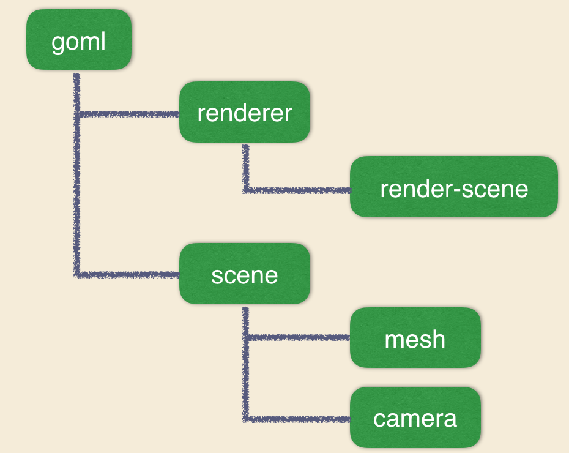
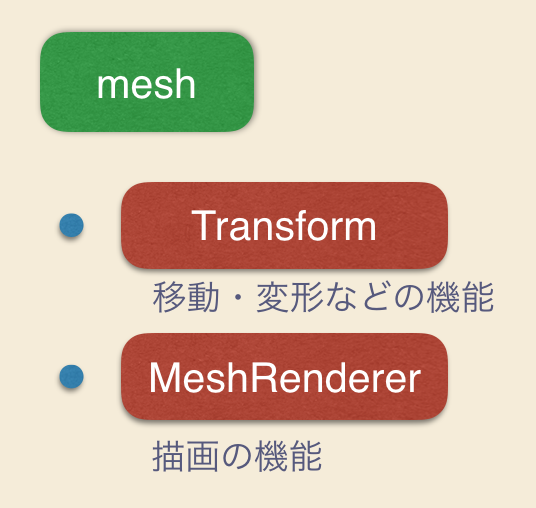
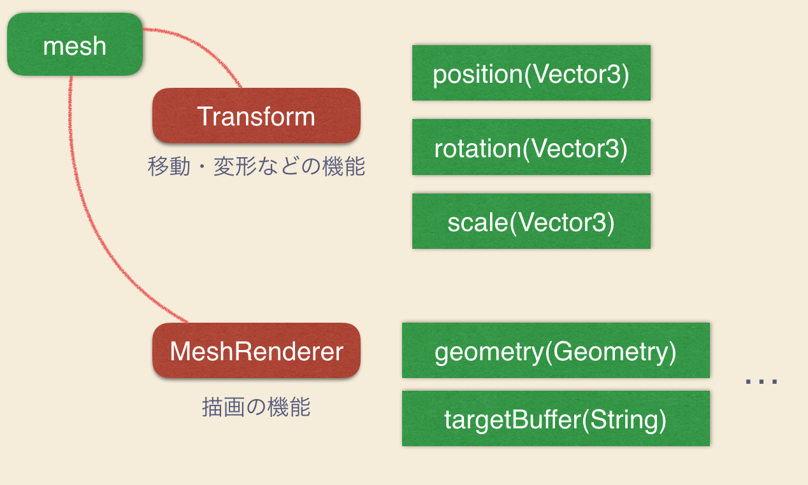

## 概要

ここではノードとコンポーネントの本質を学びます。Grimoire.jsはデータ構造として木構造を持ちます。

## 学べること

* Grimoire.jsのデータ構造
* ノードとコンポーネントの性質

### Grimoire.jsのデータ構造



Grimoire.jsでは、一つのGOMLに対して、一つの木が生成されます。上図は基本的なGOMLに関して、木構造を表したものです。



また各ノードは機能として、コンポーネントをリストにして持っています。`<mesh>`タグを例に考えてみると、移動や変形、回転の機能を持つ`Transform`コンポーネント、描画に関する機能を持つ`MeshRenderer`コンポーネントをデフォルトコンポーネントとして持っています。

このように、各ノードは特定のコンポーネントの組み合わせにより、作成されます。



書くコンポーネントはそれぞれが、適当な属性を持っています。先ほどの3章ではこのコンポーネントの属性をjavascriptを使用して変更していた、ということです。

タグとしてGOMLに記述されるノードはデフォルトコンポーネントの組み合わせを表したものです。実際にノードを作成する場合には、どのコンポーネントを組み合わせるのか、そのノードの名前を定義することが必要です。ユーザーはロジックを構築する際にはコンポーネントに記述することになります。

コンポーネントの属性は対応するノードに露出します。

```html
<mesh position="0,0,0" scale="1,1,1" rotation-"y(30d)"></mesh>
```

そのためGOMLで上記のように記述することが可能になっています。

ノードとコンポーネントの性質は以上です。

> 次はコンポーネントを自作してみましょう。また、制作したコンポーネントはnpmを通して外部に公開することが可能です。
>
> [コンポーネントを作成してみる](/tutorial/07-create-component.html)